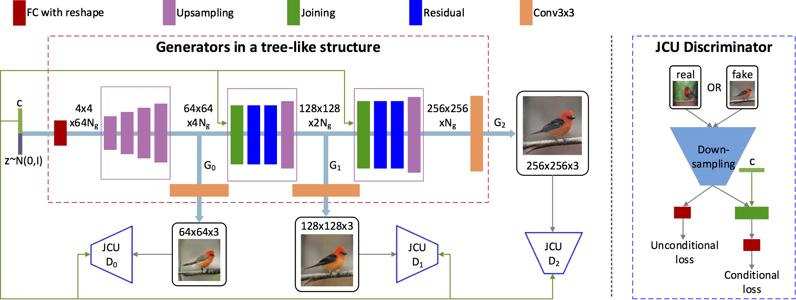
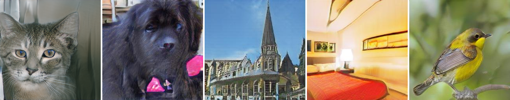

# StackGAN-v2 will be released soon

- [StackGAN-v1: Tensorflow implementation](https://github.com/hanzhanggit/StackGAN)

- [StackGAN-v1: Pytorch implementation](https://github.com/hanzhanggit/StackGAN-Pytorch)

- [Inception score evaluation](https://github.com/hanzhanggit/StackGAN-inception-model)

Pytorch implementation for reproducing StackGAN_v2 results in the paper [StackGAN++: Realistic Image Synthesis with Stacked Generative Adversarial Networks](https://arxiv.org/pdf/1710.10916.pdf) by Han Zhang*, Tao Xu*, Hongsheng Li, Shaoting Zhang, Xiaogang Wang,   Xiaolei Huang, Dimitris Metaxas.

**Examples generated by StackGAN-v2**

